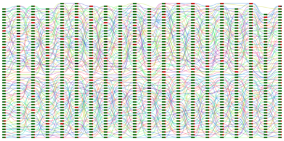

# Cooperation in Prisoner's Dilemma

A web-based prisoner's dilemma experiment. This uses [TurkServer](https://github.com/HarvardEconCS/turkserver-meteor) to study how cooperation evolves in a large population over a long period of time.

Before diving into the code, you may want to check out [Meteor](https://www.meteor.com/), on which this app is built, or the [tutorial](https://turkserver.readthedocs.io) for TurkServer.

# Experiment Demo:

You and a group of friends can play with this experiment as we ran it by following these instructions:

1. `git clone --recursive https://github.com/TurkServer/long-run-cooperation.git`
2. Go into the folder and run `meteor --settings settings-template.json`
3. Go to http://localhost:3000/ (or whatever port you are running Meteor on) to log in as a user.

Every user has to log in from a different browser session. The admin ("experimenter") must advance each round of the game manually. The default password for logging into the admin console is `something`.

If you don't have 50 friends to play with you, check out https://github.com/TurkServer/cooperation-loadtest, which can connect an arbitrary number bots to this app (making random cooperate/defect decisions). We used this to test server load limits before deploying the experiment.

- Go to http://localhost:3000/turkserver/lobby to view the users in the lobby. Select batch `pilot` from the dropdown. Enter `next-game` into the input box to do one round of random rematching.
- Go to http://localhost:3000/turkserver/experiments to view the progress of the experiment games. Select batch `pilot` from the dropdown.

Once you're done the games, you can go to http://localhost:3000/viz/pilot to see a visualization of the data collected in the game. It will look something like the following image, which we collected 20 times during our experiment. We've found these demo games to be a useful pedagogical tool for teaching behavioral game theory and learning effects.

